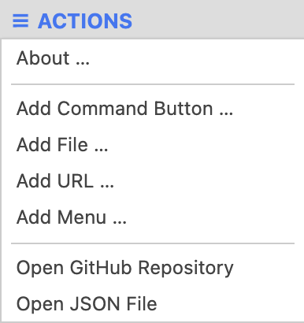
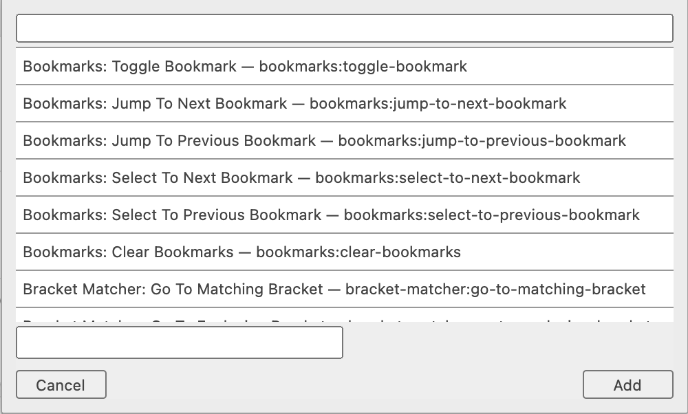
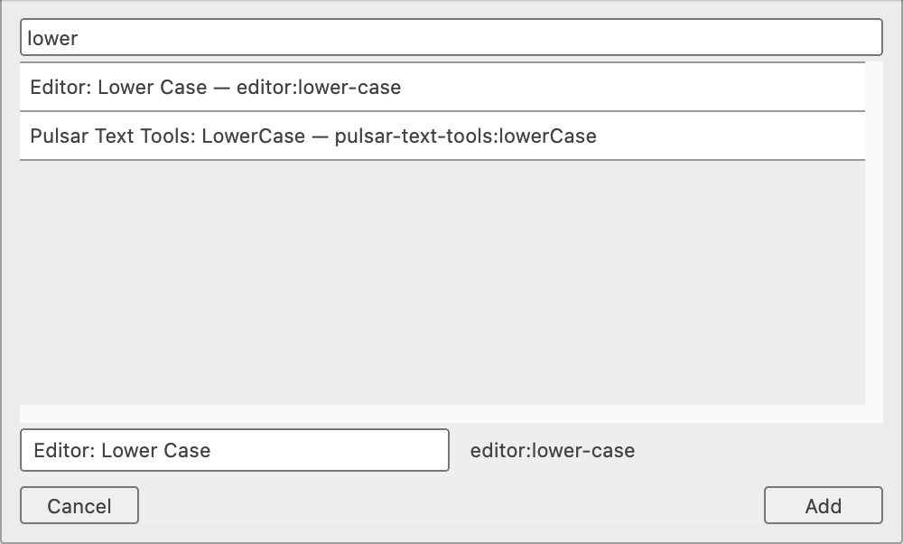
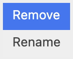
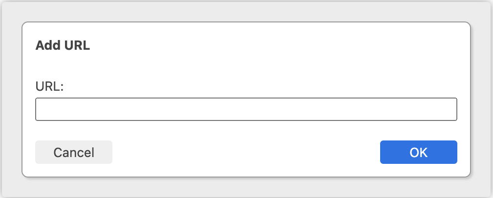

# Pulsar TBar

A toolbar for Pulsar.

##	Introduction

This package adds a toolbar for your favourite tools, files and web documents. It is inspired by [command-toolbar](https://github.com/mark-hahn/command-toolbar) by Mark Hahn.

##	Adding Tools

You can add your favourite tools from the __☰ Actions__ Menu:

Select <kbd>Add Item …</kbd>

You can scroll through the available commands or filter to find your command:

You can change the display name here or later.

##	Modifying the toolbar

If you right-click on an item:

You can:

-	Remove and item — this deletes it permanently from your toolbar.
-	Edit — you can change the display name of the toolbar item.

You can also rearrange your toolbar items by dragging them around.

##	Adding a File or URL

To add a file to the toolbar:

-	Open the file in Pulsar.
-	Select <kbd>Add File … </kbd> from the __☰ Actions__ Menu.

You can then change the display name.

To add a URL:

-	Select <kbd>Add URL …</kbd> from the __☰ Actions__ Menu.

	

-	Enter the URL manually.

You can then change the display name.

The URL will be opened in your default browser.

##	Adding a Menu

TBar also supports menus in toolbar. _However_, there isn’t (yet) an interface for creating your own menu. You’ll have to hand-code one in the `tbar.json` file. There is an example in the default file.

Sorry.

##	The `tbar.json` File

The toolbar buttons and settings are saved in the `tbar.json` file in your `.pulsar` directory. On the first launch, the `tbar.json` file will contain an empty toolbar.

In theory, you can edit the `tbar.json` file your self, but be careful. JSON files are very sensitive, and a small error will invalidate the file entirely.

If the `tbar.json` is missing or invalid, it will be replaced by a new default file.

##	Future Plans

The following will be implemented in the future:

-	Toggle the toolbar
-	Add custom menus as additional items
-	Change orientation
-	Tool Groups
-	Additional tools

##	Licence

Pulsar TBar is copyright © Mark Simon, with the MIT licence.

E & OE. This package does what it does and doesn’t what it doesn’t. Share & Enjoy.
